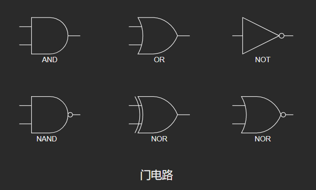
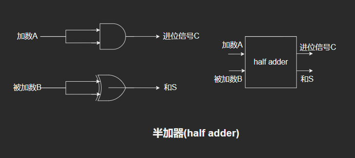
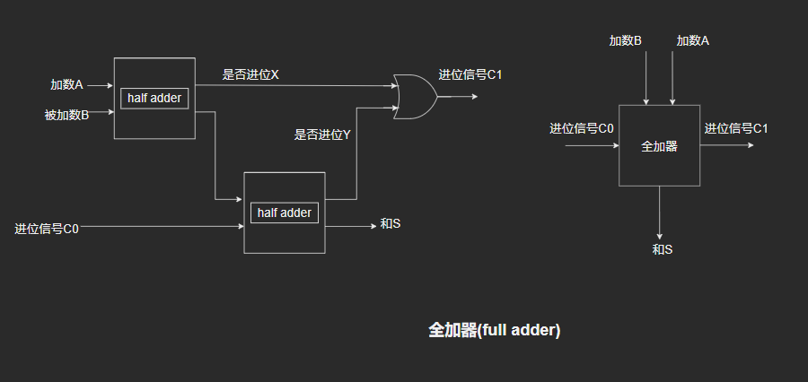
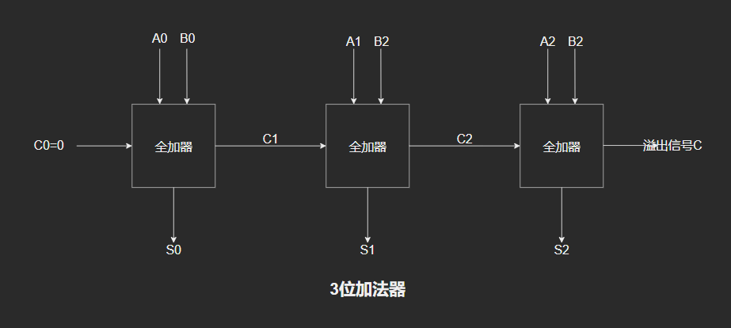
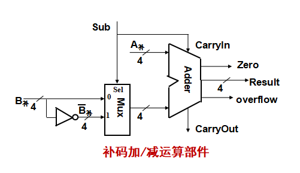

# Arithmetic Logic Operation and ALU(运算方法和运算部件)

## 不同层次程序员看到的运算及ALU

### 高级语言程序中涉及的运算(以C语言为例)

算术运算,位运算,逻辑运算,移位运算,位扩展,位截断

1. 算术运算(最基本的运算)
    - 无符号数,带符号整数,浮点数的`+` `-` `*` `\`运算
2. 按位运算
    - 用途
        - 对<font color='red'>位串</font>实现"掩码(mask)"操作或相应的其他处理(主要用于对<font color='red'>多媒体数据或状态/控制信息</font>进行处理)
    - 操作
        - 按位或: `|`
        - 按位与: `&`
        - 按位取反: `~`
        - 按位异或: `^`
            > 问题:如何从16位采样数据y中提取高位字节,并使低位字节为0
            >
            > 可用"&"实现"掩码"操作,x & 0xFF00,例如当y=2C0B时,得到结果为0x2C00
3. 逻辑运算
    - 用途
        - 用于关系表达式的运算
            例如if(x>y and i<100)中的"and"运算
    - 操作
        - OR: `||`
        - AND: `&&`
        - NOT: `!`
    - 与按位运算的差别
        - 符号表示不同
        - 运算过程不同
        - 结果类型不同
4. 移位运算
    - 用途
        - 提取部分信息
        - 扩大或缩小数值的2^n^倍
    - 操作
        - 左移: `x<<k`
        - 右移: `x>>k`
        - 不区分是逻辑移位还是算术移位,由x的类型确定
        - 无符号数:逻辑移位
            <font color='red'>高位移出,低位补0(若高位移出的是1,则左移发生溢出)</font>
        - 带符号整数:算术移位
            <font color='red'>左移:高位移出,低位补0(若移出的位不等于新的符号位,则溢出)<br>右移:低位移出,高位补符(可能发生有效数据丢失)</font>
5. 位扩展和位截断
    - 用途
        - 类型转换时可能需要数据扩展或截断
    - 操作
        - 没有专门的操作运算符,根据类型转换前后的数据长短确定时扩展还是截断
        - 位扩展:<font color='red'>无符号整数0扩展,带符号整数符号扩展</font>
        - 位截断:强行将高位丢弃,可能发生溢出
            > 例(扩展操作):在大端机上输出si,usi,i,ui的十进制和十六进制值是什么?
            >
            > ```c++
            > short si = -32768;
            > unsigned short usi = si;
            > int i = si;
            > unsigned ui = usi;
            > ```
            >
            > ```c++
            > si = 0x8000;
            > usi = 0xffff8000;
            > i = 0x00008000;
            > ui = 0xffff8000;
            > ```

            > C/C++基本数据类型长度(单位:byte)
            > |      data      | length |          range         |
            > |:--------------:|:------:|:----------------------:|
            > |      void      |    0   |         无值域         |
            > |      bool      |    1   |       true/false       |
            > |      char      |    1   |          0~255         |
            > |      short     |    2   |      -32768~32767      |
            > | unsigned short |    2   |         0~65535        |
            > |       int      |    4   | -2147483648~2147483647 |
            > |    unsigned    |    4   |      0~4294967295      |
            > |      long      |    4   | -2147483648~2174483647 |
            > |  unsigned long |    4   |      0~4294967295      |
            > |      float     |    4   |     -3.4e-38~3.4e38    |
            > |     double     |    8   |   -1.79e-308~1.79e308  |

### 指令集中涉及到的运算(以MIPS为例)

1. MIPS定点运算指令
    - 操作数: 32/16位定点数
    - 操作: `+` `-` `*` `/`
2. MIPS逻辑运算指令
    - 操作数:32/16位逻辑数(位串)
    - 操作: `and` `or` `nor` `shift left logical` `shift right logical`
3. MIPS定点比较和分支指令
    - 操作数: 32/16位定点数
    - 操作: 大小比较,相等比较
4. MIPS定点数据传送指令
    - 操作数: 32/16位带符号数
    - 操作: 加,减,符号扩展,0扩展
5. MIPS浮点算术运算指令
    - 操作数: 32位float/64位double
    - 操作:加,减,乘,除
6. MIPS浮点比较和分支指令
    - 操作数: 32/64位浮点数
    - 操作: 大小比较,相等比较

### 基本运算部件ALU的设计

ALU可进行基本的加/减算术运算和逻辑运算,<font color='red'>其核心部件是加法器</font>

#### 加法器原理

1. 门电路
   
2. 半加器
   
3. 全加器
   
4. n位加法器
   

#### 串行进位加法器

进位信号: `CarryOut = B & CarryIn | A & CarryIn | A & B`
和: `Sum = A XOR B XOR CarryIn`
进位信号延迟: `2n`
和延迟:`2n+1`
进位信号按串行方式传递速度慢

#### 先行进位加法器(CLA, Carry Look Ahead加法器)

CLA加法器由<font color='red'>进位生成/传递部件</font>,<font color='red'>CLA部件</font>,<font color='red'>求和部件</font>构成

> 进位生成函数: G<sub>i</sub> = X<sub>i</sub>*Y<sub>i</sub>
> 进位传递函数: P<sub>i</sub> = X<sub>i</sub>+Y<sub>i</sub>
> C<sub>i+1</sub>=G<sub>i</sub>+P<sub>i</sub>*C<sub>i</sub>
> S<sub>i</sub> = P<sub>i</sub>⊕C<sub>i</sub>
>
> 可以得到各级之间的进位独立产生,只与输入数据和Cin有关

#### 局部(单级)先行进位加法器(Partial Carry Lookahead adder)

实现全先行进位加法器的成本太高,将N位先行进位加法器串联

#### 多级先行进位加法器

进位生成方式: <font color='red'>组内并行,组间串行</font>
通过引入组生成/传递函数实现<font color='red'>组内并行,组间串行</font>进位,并将该逻辑电路称为<font color='red'>4位BCLA部件</font>

## 定点数运算及其运算部件

### 加/减运算及其运算部件(原码,补码,移码)

1. 补码加减运算公式
    - [A+B]<sub>补</sub>=[A]<sub>补</sub>+[B]<sub>补</sub>(MOD 2^n^)
    - [A-B]<sub>补</sub>=[A]<sub>补</sub>+[-B]<sub>补</sub>(MOD 2^2^)
2. 补码加减运算要点和运算部件
    - 加减法统一为加法
    - 符号位(最高有效位MSB)和数值位一起参加运算
    - 直接用Adder实现两个数的加运算(模运算系统)
        > 问题: 模是多少?
        >
        > 运算结果高位丢弃,保留低n位,相当于取模2^n^
    - 实现减法的主要工作为: 求[-B]<sub>补</sub>
    - [-B]<sub>补</sub>=~[B]<sub>补</sub>+1
    - 补码加/减运算部件
        
    - Sub=1时为减法,Sub=0时为加法
3. 溢出判断
    - 最高位和次高位的进位不同,最高位的进位才是真正的符号
    - 和的符号位和加数的符号位不同
4. 溢出判断逻辑(Overflow Detection Logic),溢出标志(Overflow Flag,OF/VF)
   `OF=CarryIn[N-1] XOR CarryOut[N-1]`
5. 判0逻辑(Zero Detection Logic),判0标志(ZF)
6. 逻辑标志
    - 除<font color='red'>ZF</font>,<font color='red'>OF</font>外,许多机器还生成<font color='red'>进/借位标志(CF)</font>,<font color='red'>符号标志(NF/SF)</font>等
    - 标志(Flag)在运算电路中产生,被记录到专门的寄存器中,以便在分支指令中用来作为条件
    - 存放标志的寄存器通常称为<font color='red'>程序/状态字寄存器</font>或<font color='red'>标志寄存器</font>,每个标志对应标志寄存器中的一个标志位

### 乘法运算及其运算部件

#### 无符号整数乘法

### 除法运算及其运算部件

### 定点运算器

### 十进制加减运算

## 浮点数运算及其运算部件
