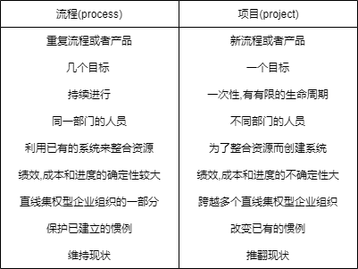

# Project Management

## Introduction

### project(项目)

项目(project)是为完成某一独特的产品或服务所做的一次性努力

1. 项目和项目管理具有唯一性
2. 项目的要素
   1. 项目是复杂的,一次性流程
   2. 项目受到预算,时间和资源的限制
   3. 项目开发是为了实现一个或一组特定的目标
   4. 项目是以客户为中心的
3. 项目的一般特点
   1. 项目是有确定生命周期的一次性努力
   2. 项目为组织战略的设计和执行奠定了基础
   3. 项目主要致力于开发最新最先进的产品,服务和组织流程
   4. 项目为变革管理提供了方法和策略
   5. 项目管理需要跨越职能和组织边界
   6. 项目管理需要传统的管理职能,如计划,组织,激励,指挥和控制
   7. 项目的主要成果是在技术,成本和进度目标内满足客户需求
   8. 一旦成功完成目标,项目便终止
4. 项目管理和流程管理的区别
    

### project life cycle(项目生命周期)

项目生命周期是指项目发展的阶段,生命周期表现了进行项目管理的逻辑性

1. 概念阶段: 项目的初始目标和技术规格的发展
2. 计划阶段: 制定详细的项目规范,图表,进度计划以及其他计划
3. 实施阶段: 做项目的具体工作,开发系统或者生产产品
4. 收尾阶段: 发生在项目移交到客户手中后,资源进行重新配置后项目收尾

### 项目成功的决定因素

triple constraint: time, budget, performance    三约束: 时间,预算,绩效
新增标准:客户接受(client acceptance)

### 项目管理成熟模型(project management maturity models)

使用基准比较(benchmarking)作为衡量维度

## 组织的环境:战略,结构和文化

> 涉及的项目管理知识体系的核心概念:项目范围管理启动,采购计划编制,项目干系人,组织影响,组织结构,组织文化与形式,社会-经济-环境的影响

### 项目与组织战略

**战略管理**(strategic management)是一门科学,它研究制定,实施与评价跨职能部门的决策,使得企业更好地达成组织**目标**(objectives)

### 干系人管理

干系人分析(stakeholder analysis):对似乎无法解决的冲突进行有效说明的工具
项目干系人(project stakeholder):与项目有利害关系的个人或群体,能给项目的发展带来潜在的正面或负面影响

1. 内部干系人:高层管理者,会计,其他职能部门经理,项目团队成员
2. 外部干系人:客户,竞争对手,供应商,环境政治消费者及其他干预群体(intervenor groups)

## 组织结构(organizational structure)
